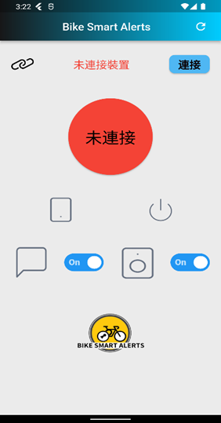
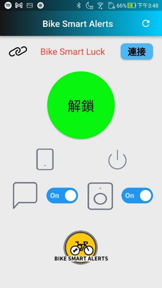
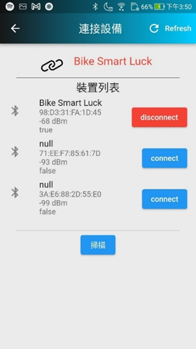

# 自行車防盜系統
勤益科大專題製作-自行車防盜系統-APP
用於連接自行製作的防盜警報裝置，
APP中包含藍芽搜尋列表、連結裝置功能，
主頁

        未連接狀態

        已連接狀態
藍芽搜尋列表

使用ardunio uno、HC-05、SW-420、RFID MFRC552製作

## Getting Started

This project is a starting point for a Flutter application.

A few resources to get you started if this is your first Flutter project:

- [Lab: Write your first Flutter app](https://flutter.dev/docs/get-started/codelab)
- [Cookbook: Useful Flutter samples](https://flutter.dev/docs/cookbook)

For help getting started with Flutter, view our
[online documentation](https://flutter.dev/docs), which offers tutorials,
samples, guidance on mobile development, and a full API reference.
