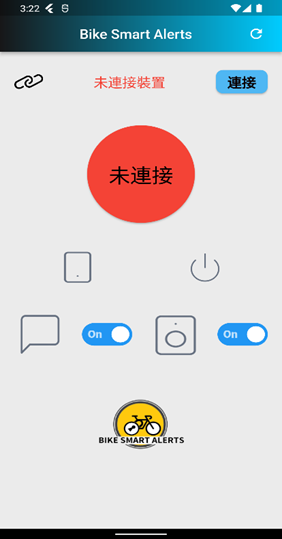
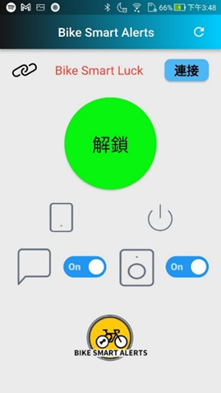
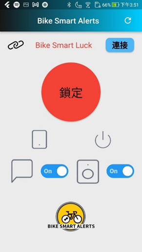
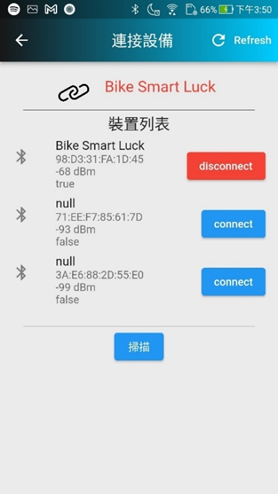

# 自行車防盜系統
</img>

## 勤益科大專題製作-自行車防盜系統-APP
用於連接自行製作的防盜警報裝置，
APP中包含藍芽搜尋列表、連結裝置功能，
搭配自製防盜警報裝置使用。

### 主畫面-未連接狀態
</img>
### 主畫面-已連接狀態(解鎖)
</img>

### 主畫面-已連接狀態(上鎖)

</img>

### 主畫面功能介紹
* 連接按鈕進駐藍芽列表
* 圓形按鈕再連接時控制鎖定/解鎖狀態
* 訊息開關設定是否出現警報提醒
* 喇叭開關設定警報鈴聲開/關
### 藍芽搜尋列表
</img>

### 未來可修正增加的功能
* 增加資料庫寫入震動數據用於分析
* 增加裝置判定，藍芽列表只出現指定裝置
* 目前為通知列及震動提醒，可增加跳出警告視窗提醒
* 只有開發安卓版且僅有測試，可增加IOS版做測試